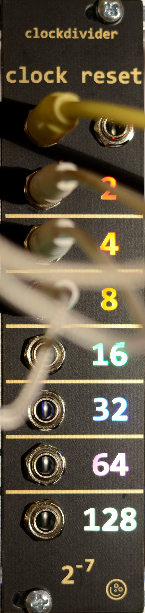
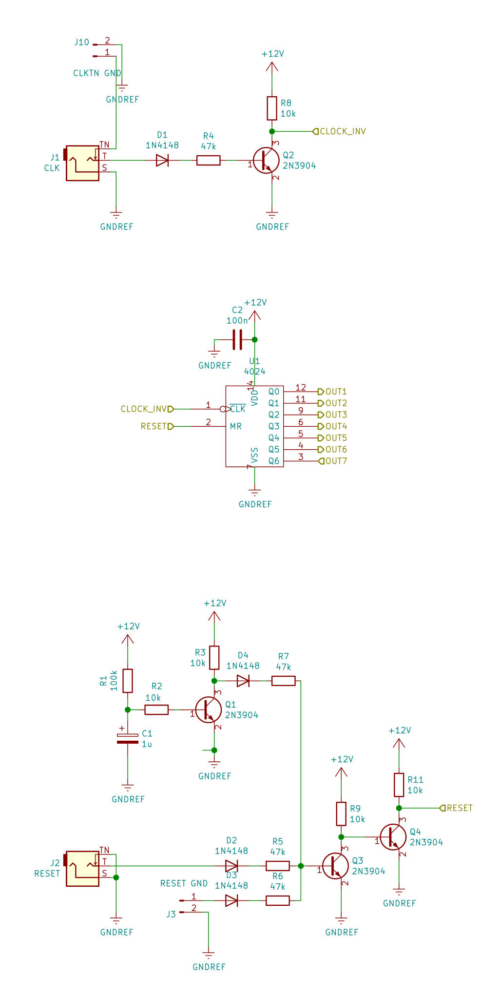
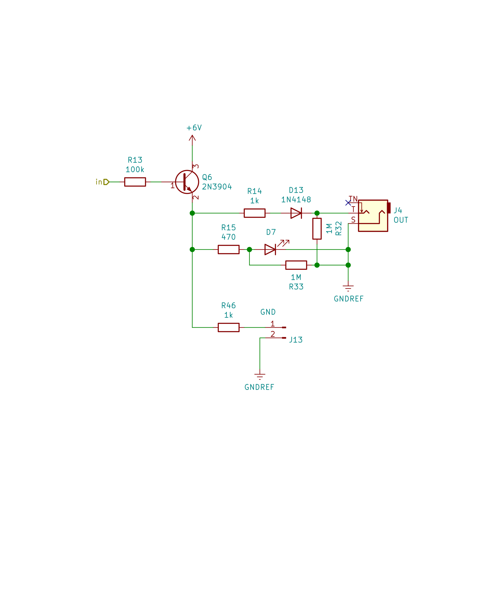
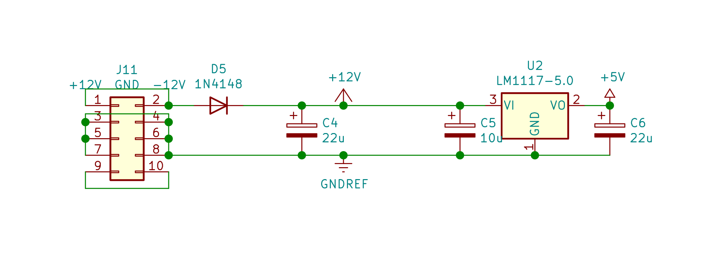

# eurorack clockdivider

## Classic CD4024 7 step binary clock-divider

  * 6hp
  * +/-12V 20mA/-
  * 1 PCB 2 layer
    * 73 parts total
    * 17 SMT, 4 THT
  * +5V gate outputs
  * clock input
    * TN pin header on pcb
  * reset input
    * 2nd pin header on pcb

Schematic and layout with KiCad 5. Panel with Inkscape + shenzen2svg → Kicad

Ordered mine at JLCPCB. Gerbers include marking for order number. BOM with part numbers for their assembly service.

Be carful with the transisors' pin numbers, because the 2N3904 schematic symbol doesn't match the MMBT3904 part (, which has its own schematic symbol). 

The CLK input is buffered and inverted by Q2.

The RESET input (and the additional pin-header) are buffered by Q3 & Q4. Q1 resets the clockdivider at startup, until C1 is charged up.

A MMBT3904 buffers each output and its LED. An additional bleeding resistor might be added to each output. But with a usual 100k load it goes to 0V without it.

LM1117 to power everything else with 5.0V.